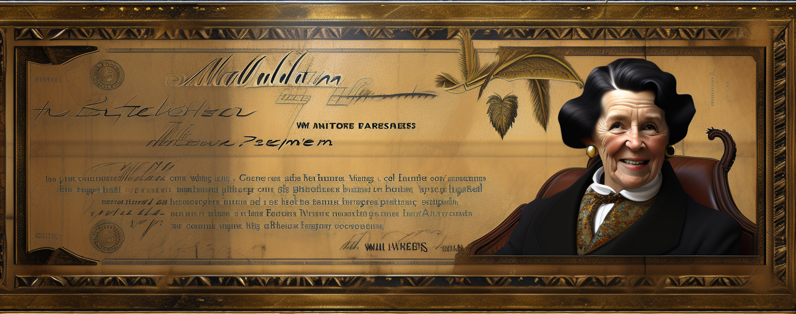

# WallpaperinaGigglesworth

WallpaperinaGigglesworth is a simple discord bot built to generate wallpapers from AI-generated images. This bot seamlessly creates high-quality wallpapers on-demand, based on prompts provided by the user. With WallpaperinaGigglesworth, customizing your screen with AI-generated images becomes easy and fun.

## Requirements
- Python 3.10 or newer
- pip for Python package management

## Setup

1. **Python Installation**
Ensure that you have Python installed on your machine. You can download Python [here](https://www.python.org/downloads/). We recommend Python 3.10.

2. **Dependencies Installation**
In your terminal, run the following command within your virtual environment to install all necessary dependencies:
```bash
pip install -r requirements.txt
```

3. **Discord Bot Creation**
Create a new bot on the Discord Developer Portal. Follow this [guide](https://discord.com/developers/docs/intro) if you need help.

4. **Environment Variables**
Create a `.env` file in the root directory of the project and add the following variables:
```bash
DISCORD_TOKEN=your-discord-token
AUTOMATIC1111_URL=your-automatic1111-url
```

5. **Running automatic1111**
[Automatic1111 SD GUI](https://github.com/AUTOMATIC1111/stable-diffusion-webui)
- Run automatic1111 with the `--api` command-line argument.

6. **Bot Startup**
Start the bot by running the `bot.py` file.

```bash
python bot.py
```

## Configuration
You can customize the bot to suit your needs by modifying some variables:

- `EXCLUDED_GUILDS`: A list of guild names to exclude from the wallpaper limit.
- `MAX_WALLPAPER_GENERATION_PER_DAY`: The maximum number of wallpapers that can be generated per day.
- `hr_upscaler`: The model used for upscaling. By default, we use "4x-UltraSharp". If you don't have this, set your preferred model (like "SwinIR_4x").

## Usage
Once the bot is up and running, using it is super simple!

1. **Set Wallpaper Size**
Begin by setting the desired wallpaper size. Mention the bot and use the command `SET_WALLPAPER_SIZE=widthxheight`. For example:

```bash
@WallpaperinaGigglesworth SET_WALLPAPER_SIZE=1080x2400
```

2. **Generate Wallpapers**
Next, generate wallpapers by providing a prompt as a message after @bot_name. For example:

```bash
@WallpaperinaGigglesworth beautiful forest view, highly detailed
```

And that's it! Your wallpaper will be generated shortly.

## License
This project is licensed under the terms of the Do What The F*** You Want (DWTFYW) License.

Enjoy using WallpaperinaGigglesworth and don't forget to share your coolest wallpapers!
